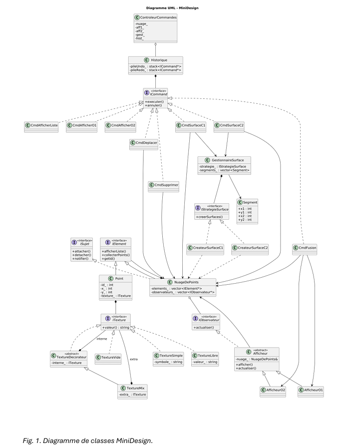

# MiniDesign Orthesis Simulator - TP4 LOG2400  

## Description
MiniDesign est un programme en C++ qui permet de manipuler une liste de points 2D et de les regrouper en nuages ou en surfaces. Il sert à illustrer l'utilisation de plusieurs patrons de conception, notamment Command pour les opérations annulables, Strategy pour la création de surfaces, Observer pour l'affichage et Decorator pour les textures.

Le but du programme est de construire progressivement une orthèse ASCII à partir de points fournis en entrée, tout en permettant à l'utilisateur d'appliquer des commandes interactives comme l'affichage, la fusion, le déplacement, la suppression, l'annulation et le rétablissement.

## Diagramme de classes


*Fig. 1. Diagramme de classes MiniDesign.*

## Compilation
   ```bash
   g++ -std=c++17 *.cpp -o MiniDesign.exe
  ```

## Exécution
   ```bash
 ./MiniDesign.exe "(5,0) (14,16) (23,0) (0,8) (0,0) (28,8)"
  ```
Le programme accepte une liste de points (x,y) séparés par des espaces.
Ensuite, utilisez les commandes interactives :
* a : afficher la liste des points et nuages
* o1 / o2 : afficher l’orthèse ASCII
* f : fusionner des points en un nuage (texture appliquée automatiquement : o puis #)
* d : déplacer un point
* s : supprimer un point
* c1 / c2 : création de surfaces selon Strategy
* u / r : undo / redo
* q : quitter

## Auteurs
* Gamaliel Kalefe
* Sara Dakir

